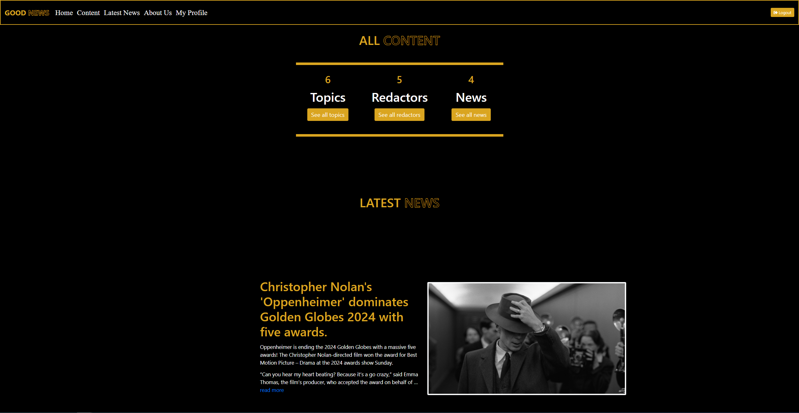
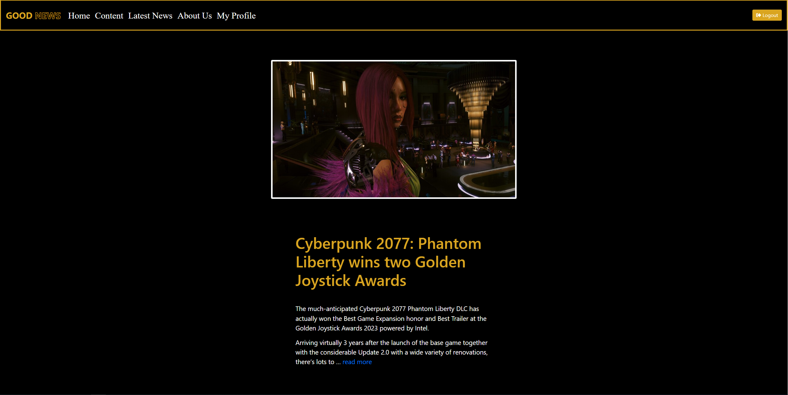
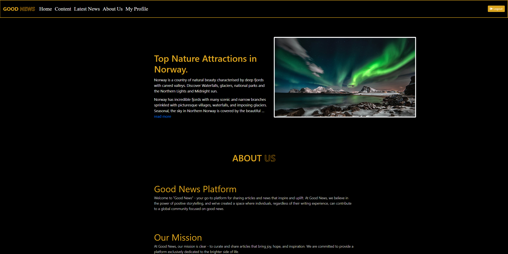
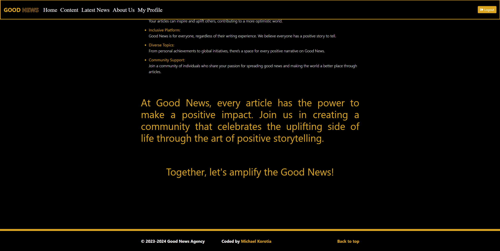
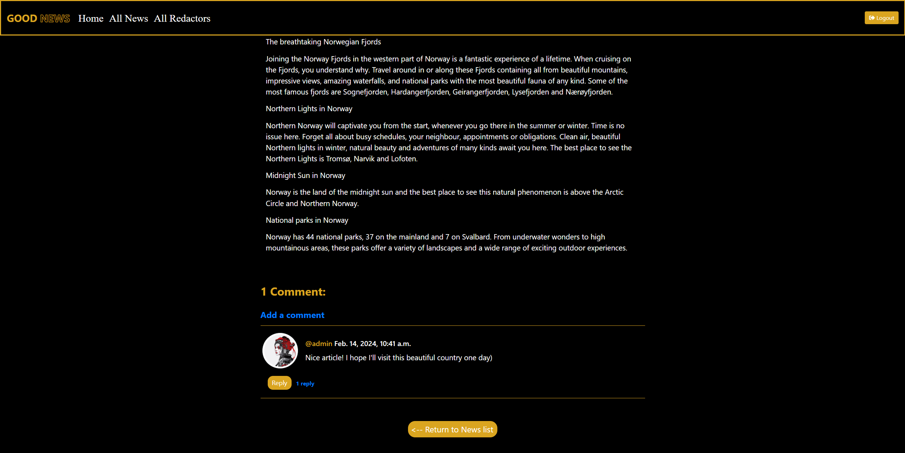
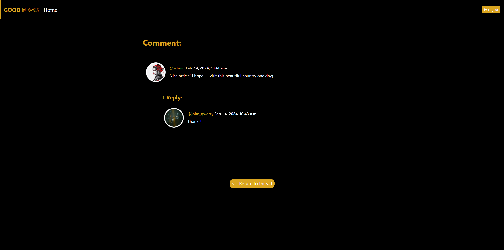
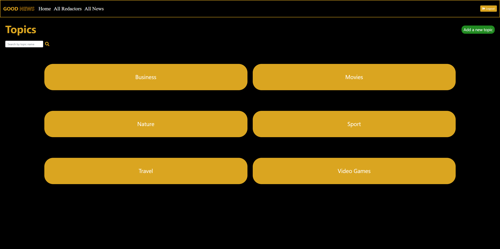
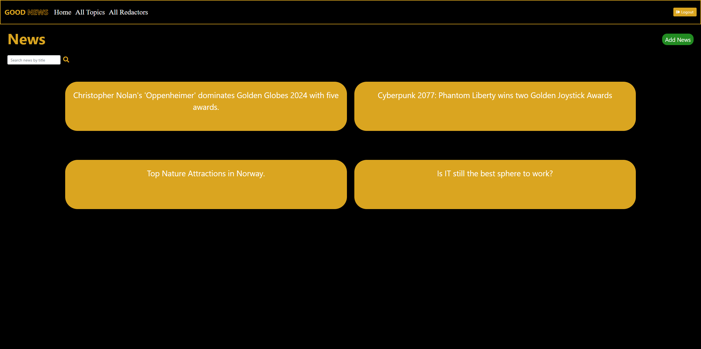
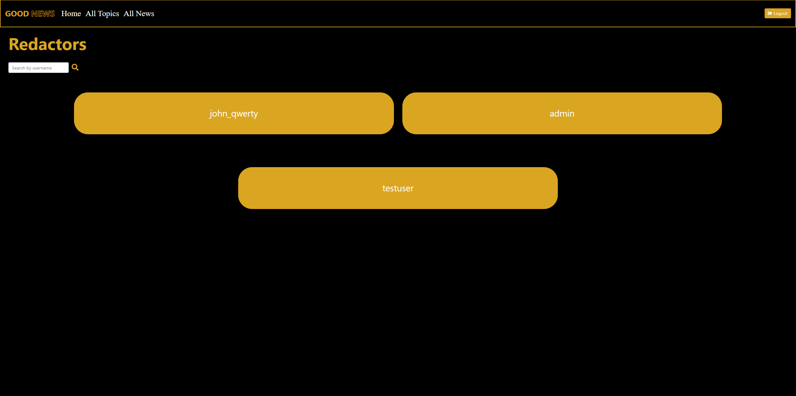
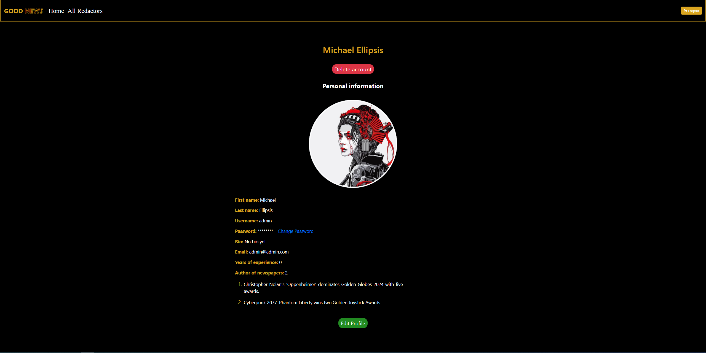

# Good News Agency

> Django project designed for users to create and share news articles, write articles on various topics,add own topics
> and engage in communication with other users.

### Project Description:

"Good News" is a dynamic newspaper agency online platform where users can create and share uplifting news articles,
write about various positive topics, and engage in communication with other users. Users can explore a wide range of
positive news topics, contribute their own articles, and interact with other members of the community through comments
and replies. With a focus on user-generated content and community interaction, Good News serves as both a source of
inspiring stories and a platform for meaningful connections within the community.

## Installation

Python3 must be already installed.

```shell
git clone https://github.com/mwellick/newspaper_agency 
cd newspaper_agency
python3 -m venv venv
source venv/Scripts/activate
pip install -r requirements.txt
python manage.py runserver #starts Django Server
```

It sets up a virtual environment, installs the necessary dependencies,
and starts the Django server, making your Newspaper Agency project
accessible for use and development

## Features

### This project makes it easy to:

- **User Account Management:**
    - Users can create and manage their accounts, providing personal details and preferences.
    - Users can reset their passwords if it's forgotten (only through the terminal), or change their existing one and customize their profile page.
- **Topic Management:**
    - Users can add new topics for news articles but admins can edit and delete them if it's necessary.
- **News Article Creation and Management:**
    - Users can create their own news articles, selecting from a variety of topics and enriching their content with
      images.
    - Users have the ability to update and delete their own news articles to keep their content current.
- **Commenting and Communication:**
    - Users can share their thoughts and engage in discussions by leaving comments on news articles.
    - The platform facilitates communication and interaction among users by enabling replies to comments, fostering
      dialogue and community engagement.
    - Users can edit and delete their own comments and replies, allowing them to maintain control over their
      contributions and engage thoughtfully with others.

## Demo

### Check it out!

[Newspaper Agency project deployed to Render](https://newspaper-agency-9guh.onrender.com)

### Test User Account

For testing and demonstration purposes, you can use the following test user account to log in:

- **Username:** testuser
- **Password:** TestPassword123

Feel free to use this test account to explore the functionality of the Newspaper Agency.













